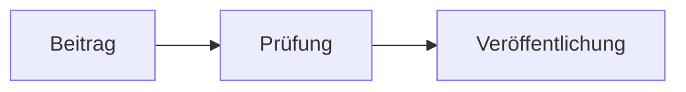
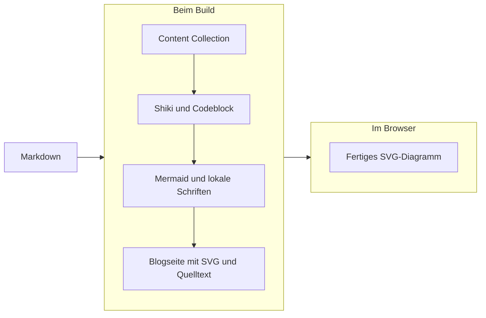
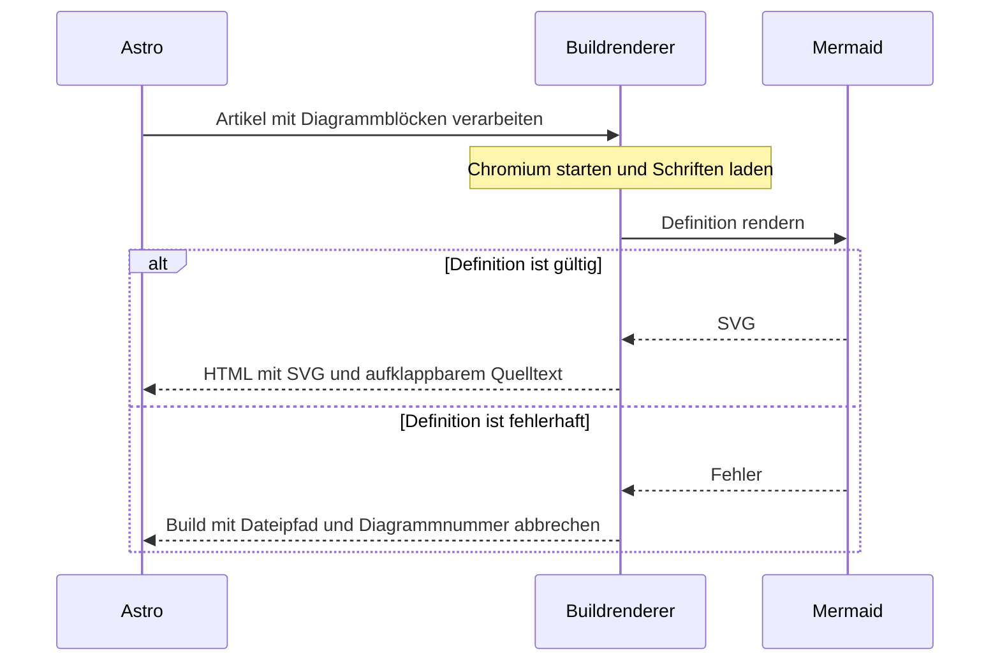
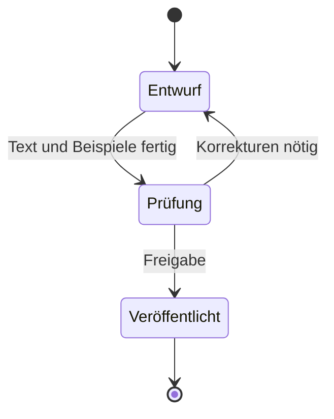
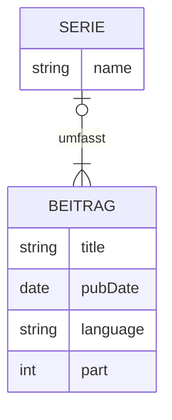
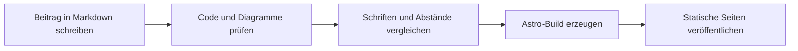

Codebeispiele zeigen einzelne Funktionen. Für die Beziehungen zwischen Komponenten
oder einen Ablauf hilft oft ein Diagramm. Mermaid erzeugt solche Diagramme aus
Text, der zusammen mit dem Artikel in Git liegt.

In [Teil 1 über Shiki und Twoslash](/blog/astro-fuer-entwicklerblogs-shiki-twoslash/)
entstanden die Codeblöcke dieses Blogs. Hier ergänze ich sie um Mermaid. Der
Quelltext bekommt dieselben Syntaxfarben, Dateititel und Copy-Buttons. Das Diagramm
übernimmt die Schriften und Farben der Website.

Die Beispiele weiter unten sind direkt gerendert. Unter jedem Diagramm lässt sich
der Quelltext aufklappen und über den Button in der Kopfzeile kopieren.

## Der Stack

| Baustein                                                                                 | Aufgabe                                                               |
| ---------------------------------------------------------------------------------------- | --------------------------------------------------------------------- |
| [Astro und Content Collections](https://docs.astro.build/en/guides/content-collections/) | Laden die Markdown-Beiträge und erzeugen beim Build statische Seiten. |
| Markdown                                                                                 | Enthält die Diagrammdefinition in einem `mermaid`-Fence.              |
| [Shiki](https://shiki.style/)                                                            | Färbt den Mermaid-Quelltext bereits beim Build ein.                   |
| [Mermaid 12.1.0](https://mermaid.js.org/config/usage.html)                               | Berechnet beim Build das Diagramm und erzeugt ein SVG.                |
| Tailwind CSS und CSS-Tokens                                                              | Gestalten Blockrahmen, Diagramm und Quelltext passend zur Website.    |
| Sätteri und Playwright                                                                   | Ergänzen das fertige SVG in Astros Markdown-Verarbeitung.             |

Die Diagramme stehen bereits im ausgelieferten HTML. Der Browser muss keine
Mermaid-Bibliothek laden oder Diagramme berechnen. Auch ohne JavaScript bleiben
die SVGs sichtbar und der Quelltext lässt sich mit einem nativen `details`-Element
öffnen. Nur die Kopierfunktion benötigt JavaScript.

Astro verwendet hier den [Sätteri-Markdown-Prozessor](https://docs.astro.build/en/guides/markdown-content/#markdown-processors).
Ein HAST-Plugin ergänzt die SVGs nach dem bestehenden Shiki-Transformer.
Playwright stellt dafür Chromium bereit. Der Browser läuft ausschließlich während
der Inhaltsverarbeitung auf dem Entwicklungsrechner oder dem Buildserver.

## Mermaid installieren und Dateien ergänzen

Die zusätzlichen Abhängigkeiten werden nur für die Entwicklung und den Build benötigt:

```sh title="Mermaid installieren"
pnpm add -D mermaid playwright @astrojs/markdown-satteri satteri
pnpm exec playwright install --only-shell chromium
```

Dieser Beitrag verwendet Mermaid 12.1.0. Das Lockfile hält die tatsächlich
installierte Version fest. Auf einem Linux-Buildserver installiert
`playwright install --with-deps --only-shell chromium` zusätzlich die benötigten
Systembibliotheken. MDX und eine hydratisierte UI-Komponente sind nicht nötig.

Die Diagrammverarbeitung liegt bei den bestehenden Blogdateien:

```text title="Dateien für die Mermaid-Integration"
src/
  lib/
    mermaid.ts
    shiki/code-block.ts
  components/blog/
    code-block-controls.astro
  layouts/blog-layout.astro
  styles/
    global.css
    blog.css
  i18n/translations/
    de.ts
    en.ts
```

Der Transformer erzeugt das HTML. `mermaid.ts` ergänzt die SVGs im Markdown-Prozessor.
Die Astro-Konfiguration bindet das Plugin ein. `global.css` enthält
die gemeinsamen CSS-Tokens. `blog.css` gestaltet die erzeugten Elemente und wird
nur im Bloglayout importiert. Die Kopierfunktion bleibt in `code-block-controls.astro`.

## Mermaid im vorhandenen Transformer erkennen

Ein Mermaid-Block verwendet dieselben Fence-Zusätze wie ein gewöhnlicher Codeblock:

````md title="Ein Diagramm im Markdown-Beitrag"

````

Im `root`-Hook des Shiki-Transformers steht die Sprache über `this.options.lang`
zur Verfügung. Für Mermaid verwende ich den ursprünglichen Quelltext aus
`this.source`. Zeilennummern und die erzeugten HTML-Elemente gehören nicht zur
Diagrammdefinition.

```ts title="src/lib/shiki/code-block.ts · Erkennung"
const mermaid = this.options.lang === "mermaid"
```

Der bestehende Transformer legt die Kopfzeile und den Copy-Button an. Für Mermaid
setzt er darunter einen zunächst verborgenen Diagrammbereich und ein geöffnetes
`details`-Element mit dem eingefärbten Quelltext. Als Kopiertext erhält der Button
`this.source`. Ohne Dateititel heißt die Kopfzeile "Mermaid":

```html title="Aufbau des erzeugten Diagrammblocks"
<figure class="code-block mermaid-block" data-mermaid>
  <div class="code-block-header">
    <!-- Titel und vorhandener Copy-Button mit data-copy-code -->
  </div>
  <div class="mermaid-diagram" hidden role="region" tabindex="0"></div>
  <details class="mermaid-source" open>
    <summary>Quelltext anzeigen</summary>
    <pre class="astro-code"><code><!-- Shiki-Quelltext --></code></pre>
  </details>
</figure>
```

Im tatsächlichen Markup stehen deutsche und englische Summary-Texte. CSS wählt sie
anhand von `html[lang]` aus. Damit passt die Bedienoberfläche auch ohne JavaScript
zur URL-Sprache. Die Diagrammbeschriftungen bleiben in der Sprache des Beitrags.

## Das Diagramm beim Build rendern

Die Astro-Konfiguration ergänzt das Plugin im Markdown-Prozessor:

```js title="astro.config.mjs · Einbindung"
import { defineConfig } from "astro/config"
import { satteri } from "@astrojs/markdown-satteri"
import { mermaidDiagrams } from "./src/lib/mermaid.ts"

const mermaid = mermaidDiagrams()

export default defineConfig({
  integrations: [mermaid.integration],
  markdown: {
    processor: satteri({ hastPlugins: [mermaid.plugin] })
    // Die vorhandene shikiConfig bleibt hier erhalten.
  }
})
```

Das Plugin sucht im HAST nach den vom Shiki-Transformer angelegten Diagrammblöcken.
Bei Artikeln ohne Diagramme startet es keinen Browser. Für alle Diagramme eines
Artikels öffnet es gemeinsam eine Chromium-Instanz und schließt sie anschließend.

Der Renderer lädt die vorhandenen CSS-Tokens und die lokal installierte
JetBrains Mono. Erst nach `document.fonts.load()` und `document.fonts.ready`
misst Mermaid die Beschriftungen aus. Dadurch entstehen Knotenbreiten und
Zeilenumbrüche mit derselben Schrift wie auf der Website.

Jeder Artikel erhält ein stabiles ID-Präfix aus seinem Dateipfad. Die einzelnen
Diagramme ergänzen ihre Position im Artikel. `deterministicIds` und
`deterministicIDSeed` stabilisieren auch Mermaids interne IDs. Ein fester
`handDrawnSeed` verhindert zufällige Unterschiede in den SVG-Pfaden von
ER-Tabellen, die intern auch beim `classic`-Look Rough.js verwenden. Der Kern des
Renderings läuft im Buildbrowser:

```ts title="src/lib/mermaid.ts · Rendering im Buildbrowser"
for (const [index, definition] of definitions.entries()) {
  const { svg } = await mermaid.render(`${prefix}-${index + 1}`, definition)
  // Das HAST-Plugin fügt dieses SVG in den zugehörigen Diagrammbereich ein.
}
```

Anschließend ergänzt das Plugin den zugänglichen Namen des Scrollbereichs aus
dem SVG-Titel, zeigt das Diagramm an und klappt den Quelltext ein. Eine fehlerhafte
Definition stoppt den Build mit Dateipfad und Diagrammnummer. So wird eine kaputte
Grafik vor der Veröffentlichung erkannt.

Die Collection verwendet Astros
[`deferRender: true`](https://docs.astro.build/en/reference/content-loader-reference/#deferrender).
Dadurch läuft die Markdown-Verarbeitung beim Rendern der Seite durch Vite.
Die Integration registriert CSS- und Schriftdateien mit `addWatchFile`, damit
Änderungen einen Neustart der Konfiguration auslösen. So bleiben im Devserver
keine SVGs aus einem älteren Stand der Gestaltung im Inhaltscache erhalten.
Beim Produktionsbuild entsteht weiterhin vollständiges statisches HTML.

Die Definition bleibt am Copy-Button erhalten. Das SVG ersetzt den Quelltext nicht.
Auch nach dem Rendern lässt sich die Definition mit dem nativen `details`-Element
öffnen, lesen und kopieren.

## Mermaid wie die Website gestalten

### Farben und Schriften übernehmen

Mermaids Standardfarben passen nicht zur monochromen Gestaltung dieses Blogs.
Die Integration verwendet das anpassbare `base`-Theme und den `classic`-Look.
Diagrammtypen mit eigenen Defaults erhalten diese Angaben ebenfalls ausdrücklich.
Die Details beschreibt die [Mermaid-Dokumentation zum Theming](https://mermaid.js.org/config/theming.html).

Die Farbzuordnung folgt den bestehenden CSS-Tokens:

| CSS-Token       | Aufgabe im Diagramm                                        |
| --------------- | ---------------------------------------------------------- |
| `--color-paper` | Helle Knoten und Akteure                                   |
| `--color-ink`   | Beschriftungen                                             |
| `--color-muted` | Pfeile, Linien und Knotenränder                            |
| `--color-rule`  | Dezente Gruppenränder                                      |
| `--color-code`  | Hintergrundflächen, Notizen und alternative Tabellenzeilen |
| `--font-mono`   | JetBrains Mono für Diagrammbeschriftungen                  |

Mermaids Farbberechnung erwartet Hex-Werte. Die Farb-Tokens der Website verwenden
deshalb dieses Format. Auch der Codeblock-Hintergrund steht als Hexwert im CSS:

```css title="src/styles/global.css · Codeblock-Hintergrund"
@theme static {
  --color-code: #f8f8f8;
}
```

`@theme static` erhält den Token auch dann im erzeugten CSS, wenn Tailwind ihn
nicht in einer Utility-Klasse findet. Der Buildrenderer liest ihn beim Rendern, und
`blog.css` verwendet ihn über eine `@reference` auf `global.css`.

Der Renderer liest diese Werte direkt aus den CSS-Tokens:

```ts title="src/lib/mermaid.ts · CSS-Farben im Buildbrowser lesen"
const style = getComputedStyle(document.documentElement)

function color(name: string) {
  return style.getPropertyValue(name).trim()
}
```

So bleibt die Website die Quelle der Farben. Eine Änderung an den Tokens kommt
auch bei Mermaid an. Die Konfiguration ergänzt die Grundfarben und die Stellen,
an denen Mermaids abgeleitete Farben von der Websitegestaltung abweichen:

```ts title="src/lib/mermaid.ts · Theme-Auszug"
const paper = color("--color-paper")
const ink = color("--color-ink")
const muted = color("--color-muted")
const rule = color("--color-rule")
const surface = color("--color-code")
const appearance = { theme: "base", look: "classic", useMaxWidth: false } as const
const code = document.querySelector<HTMLElement>(".astro-code")!
const fontSize = getComputedStyle(code).fontSize

mermaid.initialize({
  startOnLoad: false,
  securityLevel: "strict",
  suppressErrorRendering: true,
  htmlLabels: false,
  layout: "elk",
  theme: "base",
  look: "classic",
  fontFamily: "var(--font-mono)",
  fontSize: parseFloat(fontSize),
  themeVariables: {
    fontFamily: "var(--font-mono)",
    fontSize,
    background: surface,
    primaryColor: paper,
    primaryTextColor: ink,
    primaryBorderColor: muted,
    secondaryColor: surface,
    secondaryTextColor: ink,
    secondaryBorderColor: muted,
    tertiaryColor: paper,
    tertiaryTextColor: ink,
    tertiaryBorderColor: muted,
    lineColor: muted,
    clusterBkg: surface,
    clusterBorder: rule,
    signalColor: muted,
    noteBkgColor: surface,
    noteBorderColor: muted,
    noteTextColor: ink,
    activationBorderColor: muted,
    sequenceNumberColor: paper,
    attributeBackgroundColorOdd: paper,
    attributeBackgroundColorEven: surface
  },
  flowchart: {
    ...appearance,
    curve: "linear",
    subGraphTitleMargin: { top: 12, bottom: 12 }
  },
  sequence: appearance,
  state: appearance,
  er: appearance
})
```

Das `base`-Theme übernimmt viele Werte bereits aus den Grundfarben. Zum Beispiel
folgen Akteure der primären Knotenfarbe, ihr Text `primaryTextColor` und ihre
Ränder `primaryBorderColor`. Diese Zuordnungen müssen nicht einzeln wiederholt
werden. Gruppenränder, Notizen und Tabellenzeilen bekommen die passenden Tokens
ausdrücklich zugewiesen.

Die Schriftfamilie lässt sich direkt als `var(--font-mono)` übergeben. Mermaid
setzt sie in SVG-Styles ein, die der Browser auch beim Ausmessen der Texte
auflöst. Der Tokenname `--font-mono` allein wäre dagegen ein Schriftname.

Die Schriftgröße stammt aus dem berechneten CSS des Quelltextblocks: hier 14
Pixel. Mermaid verwendet sie bereits beim Ausmessen der Beschriftungen.
Sequenzdiagramme benötigen zusätzlich die numerische `fontSize` auf der obersten
Konfigurationsebene. Die Themevariable allein ändert ihre Inline-Schriftgrößen
nicht.

Eine nachträgliche Änderung im SVG könnte die Texte verkleinern, ohne Knoten und
Abstände neu zu berechnen. `subGraphTitleMargin` reserviert bei Gruppen jeweils
12 Pixel oberhalb und unterhalb der Überschrift. So sitzt sie nicht direkt auf
dem Rahmen. Die Option ist in der
[Flowchart-Konfiguration](https://mermaid.js.org/config/schema-docs/config-defs-flowchart-diagram-config.html#subgraphtitlemargin)
beschrieben.

`htmlLabels: false` hält die Beschriftungen in SVG-Elementen. Damit wirken die
allgemeinen Markdown-Styles für Absätze, Tabellen und Inline-Code nicht auf
HTML innerhalb eines Diagramms. `securityLevel: "strict"` deaktiviert unter
anderem Mermaid-Klickaktionen. `suppressErrorRendering: true` überlässt die
Fehlerbehandlung dem Buildrenderer.

### Den Block und die mobile Darstellung abstimmen

Der äußere Rahmen verwendet `.code-block`, die neue Diagrammfläche ergänzt nur
Innenabstand und einen lokalen Scrollbereich:

```css title="src/styles/blog.css · Diagrammfläche"
.mermaid-diagram {
  overflow-x: auto;
  padding: 1rem;
}

.mermaid-diagram > svg {
  display: block;
  height: auto;
  margin-inline: auto;
}
```

Mit `useMaxWidth: false` setzt Mermaid selbst die natürliche Breite und Höhe am
SVG. CSS übernimmt diese Größe und zentriert das Diagramm. Dadurch bleibt auch
die 14 Pixel große Schrift erhalten. Breitere Diagramme scrollen innerhalb des
Blocks.

Der Scrollbereich ist per Tab erreichbar und über den zugänglichen Diagrammtitel
benannt. Der Quelltext-Schalter verwendet dieselben Abstände und Farben wie die
Codeblock-Kopfzeile. Diagrammbeschriftungen, Code und Titel verwenden JetBrains Mono.

## Diagramme ausprobieren

Alle folgenden Definitionen enthalten `accTitle` und `accDescr`. Mermaid erzeugt
daraus Titel, Beschreibung und ARIA-Verweise im SVG. Der Fließtext erklärt den
Inhalt zusätzlich. Siehe [Mermaids Barrierefreiheitsoptionen](https://mermaid.js.org/config/accessibility.html).

### Flowchart für den Blog-Stack

Astro verarbeitet den Beitrag beim Build. Shiki erzeugt den Quelltextblock,
anschließend ergänzt Mermaid das fertige SVG:



Dieser Block prüft Gruppen, Pfeile und mehrzeilige Abläufe. Beim Kopieren dürfen
die eingeblendeten Zeilennummern nicht in der Definition stehen.

### Sequenzdiagramm für das Rendering

Der Buildrenderer erzeugt die Grafik vor der Veröffentlichung. Eine ungültige
Definition bricht den Build ab:



Hier lassen sich die Farben von Akteuren, Nachrichten, Notizen und alternativen
Abläufen vergleichen. Auch diese Flächen sollen zur Website passen.

### Zustandsdiagramm für die Veröffentlichung

Ein Beitrag kann zwischen Entwurf und Prüfung wechseln, bevor er veröffentlicht
wird. Das Diagramm beschreibt den redaktionellen Ablauf, nicht zusätzliche
Funktionen der Content Collection:



Dieser Block prüft Zustandsknoten, Start- und Endmarkierungen sowie Umlaute in
Beschriftungen.

### ER-Diagramm für Serie und Beiträge

Das Collection-Schema enthält ein optionales Serienobjekt mit Name und Teilnummer.
Das folgende Modell zeigt diese Beziehung. Es beschreibt keine zusätzliche
Datenbank im Blog:



Die abwechselnden Zeilenflächen des ER-Diagramms müssen ebenfalls die hellen
Grautöne verwenden. Die Beziehungslinien bleiben deutlich sichtbar.

### Ein breites Diagramm auf dem Smartphone

Dieser längere Ablauf ist absichtlich horizontal angeordnet. Auf einem schmalen
Display sollte nur die Diagrammfläche seitlich scrollen:



## Die Funktionen prüfen

- **Quelltext öffnen und kopieren.** Die Definition muss vollständig bleiben,
  einschließlich Leerzeilen und `accDescr`. Dateititel und Zeilennummern gehören
  nicht zum kopierten Text.
- **Mehrere Diagramme ansehen.** Jedes SVG braucht eigene IDs. Pfeile und
  Beschriftungen dürfen sich nicht auf ein anderes Diagramm beziehen.
- **Mit der Tastatur bedienen.** Tab erreicht den Copy-Button, den Scrollbereich
  und den Quelltext-Schalter. Enter öffnet den Quelltext.
- **Auf schmalen Displays lesen.** Die Seite bleibt innerhalb der Fensterbreite.
  Breite Diagramme haben einen eigenen Scrollbereich.
- **Ohne JavaScript lesen.** Das SVG ist sofort sichtbar. Der Quelltext lässt
  sich weiterhin öffnen und lesen.
- **Fehler behandeln.** Eine ungültige Definition muss den Build mit Dateipfad
  und Diagrammnummer abbrechen.

Für den letzten Fall eignet sich eine temporäre Testdefinition:

````md title="Fehlerfall für einen lokalen Testartikel"
```mermaid title="Absichtlich ungültig"
flowchart TD
  A -->
```
````

Die ungültige Definition oben wird hier als Markdown-Beispiel gezeigt. Die fünf
Diagramme dieses Artikels sind gültige Beispiele. Die Integration wird zusätzlich
mit den vorhandenen Projektprüfungen verifiziert:

```sh title="Projekt prüfen"
pnpm validate
```

## Nachtrag: weniger JavaScript durch fertige SVGs

Die erste Fassung dieses Artikels renderte Mermaid im Browser. Ein späterer Blick
auf den Produktionsbuild zeigte, dass der Artikel dafür rund 2,43 MB JavaScript
lud, etwa 712 kB nach gzip-Kompression. Dazu gehörte auch die ELK-Layoutbibliothek.
Die großen Chunks betrafen also den fertigen Build.

Deshalb entstehen die SVGs inzwischen beim Build. Mermaid und ELK werden nicht
mehr an Besucher ausgeliefert. Die Diagramme behalten ihre Gestaltung und sind
auch ohne JavaScript sichtbar. Als zusätzlicher Schritt ist Chromium auf dem
Buildrechner erforderlich. Dieser Artikel und seine Beispiele beschreiben bereits
die neue Umsetzung.
